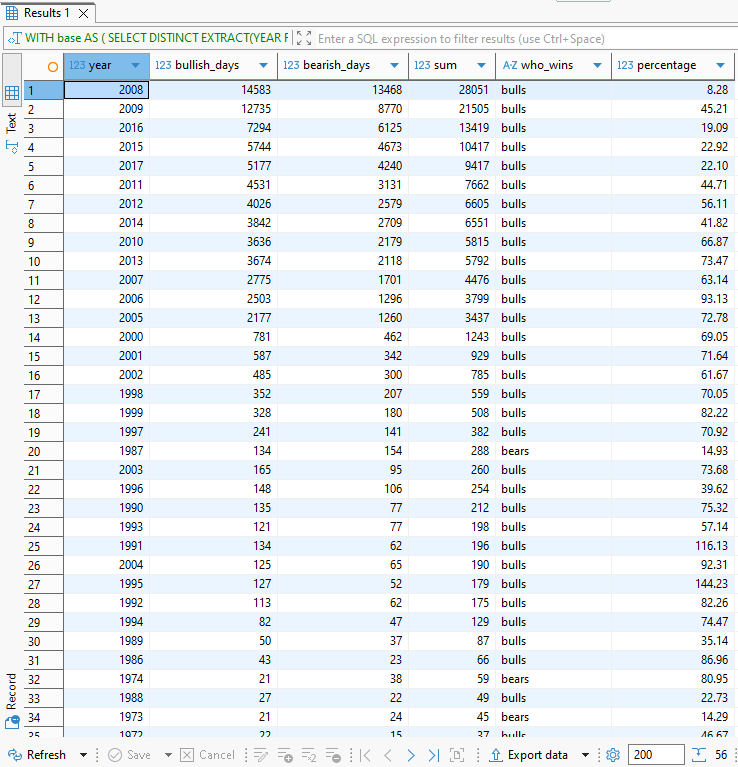
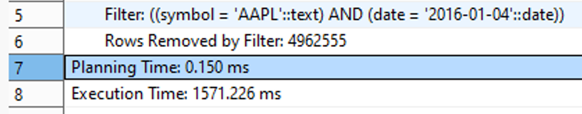
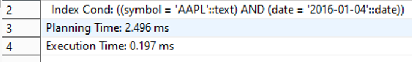

# SQL Stock Market Analysis

DATASET: Historical stock market prices

DATASET Source: https://www.kaggle.com/datasets/borismarjanovic/price-volume-data-for-all-us-stocks-etfs

ROWS: 14,887,665

Columns:
date, open, high, low, close, volume, symbol

## Project Overview
This project focuses on building a high-performance end-to-end analytical pipeline for a massive financial dataset containing 14.8 million records. The goal was to transform raw historical stock data into actionable financial insights while ensuring 100% data integrity and optimizing database performance for big-data scale.

Key Objectives:
Data Ops & Integrity: Implementing logical audits to identify and handle corrupted market data (price anomalies, zero volumes).

Financial Engineering: Calculating core risk and trend metrics (SMA 50/200, Daily Returns, Monthly Volatility) using advanced SQL window functions.

System Optimization: Engineering B-Tree indexes to achieve a 7900x increase in query execution speed.

### Tools:
- PostgreSQL
- SQL

### Data Wrangling
Original dataset consists of multiple individual text files per ticker. Data was aggregated into a single unified CSV table for comprehensive analysis.

## Data Exploration

### Dataset preview
- Initial look at the database

### Basic table exploration
- Discovered rows count: 14,887,665

### timeline and stocks check
- Discovered date range from 1962 to 2016
- Unique Stocks from 2 to 7163

### Volume check by day / Volume check by year
- 10 days with top volume are in 2017. 
- 10 "year" with top volume are 2007-2016.
That shows the market has a stable growth. 2017 didn"t appear in top 10 because it hasn't ended in dataset.

### Openint check
-All values in that column are zero. No need to use it in the further analysis.

## Data quality audit & integrity

### Logical test
- Identified 60 records with corrupted logic (Low > High or open/close = 0) likely due to upstream data feed errors.
- Those data will be deleted in further analysis

### Stagnation Test
- Discovered 289,817 records (~1,95% of dataset) where **Low** = **High**.

### Null_Test
- No null data found

### Duplicate_Test
- Returned empty table. That means no duplicates found.

## Business Analytics

### Average by year
- Calculated averages taking into account **'Logical Test'**

### Daily return
- Calculated daily return on latest 100  days for 'aapl' ticket

### Bullish days vs Bearish days
- Calculated metrics on each year
   - **1** Bullish_days (when close > open + 10%)
   - **2** Bearish_days (when close < open - 10%)
   - And price did not crossed 5% further out of close/open
   - Sum of those days

- Identified who lead the year bull or bears
- Calculated the percentage of how much better leader performs

### SMA_50 and SMA_200
-Calculated SMA50 and SMA 200 for 'aapl' ticket

### Volatility Analysis
- Calculated standard deviation for one trading month (21 days) for 'aapl' ticket

### Liquidity Ranking
- Devided stocks on four groups based on their average volume in 2017.

## Optimization
- Created index based on two variables date and symbol.
It decreased search time from 1571.226 ms to 0.197 ms

---

 

